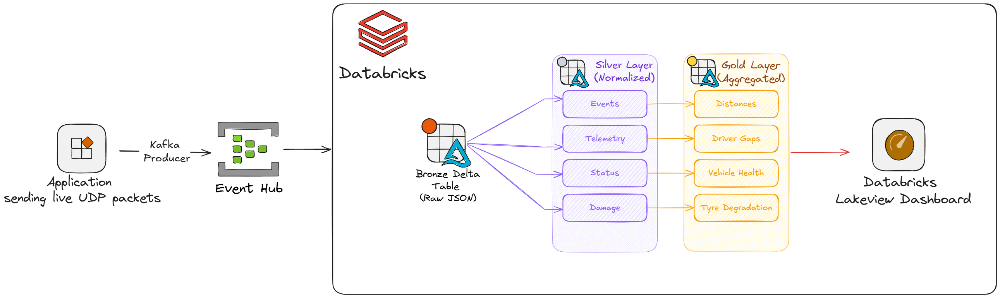
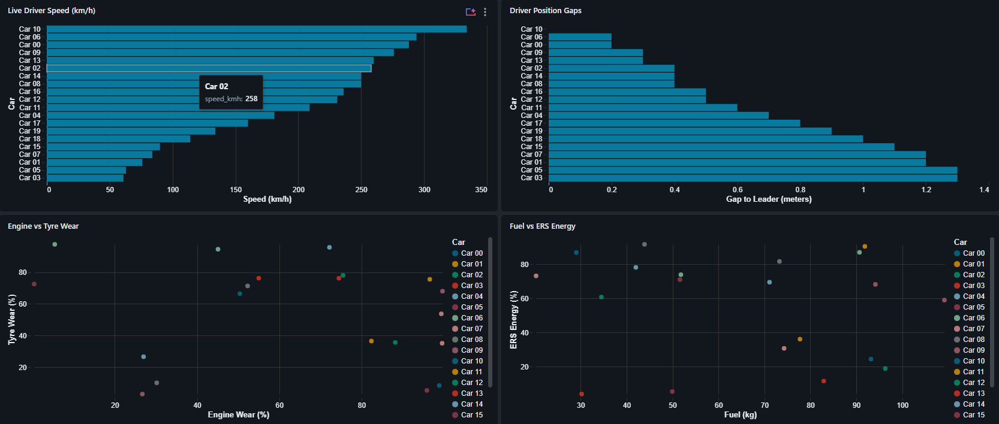
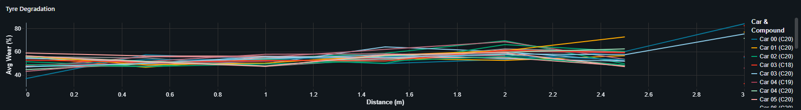

# F1 Telemetry Streaming Platform

This is a side project to learn more about databricks and the goal is to simulate the working of a data engineering pipeline for real-time telemetry streaming using live data from the scenario of F1 races.


---

## Overview

The F1 Telemetry Streaming Platform captures high-frequency telemetry data, streams it to databricks, and processes it to produce insights on the race. By utilizing a Medallion architecture (Bronze, Silver, Gold), the platform cleans, normalizes, and aggregates raw byte-streams into insights, powering a live Databricks AI/BI Lakeview dashboard.

The basic pipeline works as follows:
1. The live data from the a synthetic data generator (or from the F1 game itself, though not implemented in this project) is ingested into the system using UDP.
2. The data is processed and transformed into a structured format (JSON).
3. The data is then pushed to Azure Event Hubs.
4. The data is then processed and transformed into a structured format (Delta Lake).
5. Finally, the data is visualized in a Databricks Lakeview dashboard.

---

## Tech Stack

- **Data Generation/Ingestion**: Python 3.11+, `socket`, `struct`, `confluent-kafka`
- **Message Broker**: Azure Event Hubs (Kafka protocol)
- **Data Engineering**: Databricks, PySpark (Structured Streaming)
- **Storage**: Delta Lake, Unity Catalog
- **Visualization**: Databricks AI/BI Dashboards (Lakeview)

---

## High Level Architecture



1. **Edge Ingestion (Python)**: Subscribes to F1 Game UDP packets (Port 20777). Uses `struct` unpacking to pick out Core Packets (Event, Car Telemetry, Car Status, Car Damage) and concurrently pushes them to Azure Event Hubs via a Kafka connection.
2. **Message Broker (Azure Event Hubs)**: Acts as the Kafka topic `telemetry_topic` to buffer the high-velocity incoming streams.
3. **Stream Processing (Databricks / PySpark)**: A unified Spark Structured Streaming pipeline applying Medallion tier transformations in continuous micro-batches:
    - **Bronze**: Raw JSON payloads ingested from Kafka into Delta tables.
    - **Silver**: Fan-out routing into specific domain tables (Events, Telemetry, Status, Damage).
    - **Gold**: Complex stateful stream-stream aggregations computing live driver gaps, vehicle health, and tyre degradation curves.
4. **Visualization**: A live Databricks Lakeview dashboard updating in set intervals to visualize driver speeds, grid positions, and matrix-based hardware wear.




---

## Data Model: Raw Data (UDP / JSON)

The raw ingestion maps binary UDP packets from the F1 Game into a standardized JSON payload structure before hitting Kafka:

- `m_packetId`: Integer identifier (3=Event, 6=Telemetry, 7=Status, 10=Damage)
- `m_playerCarIndex`: ID of the driver/car (0-21)
- `timestamp`: ISO-8601 formatted ingestion time
- **Telemetry Data**: `speed_kmh`, `engine_rpm`, `gear`, `throttle`, `brake`, `engine_temperature`
- **Status Data**: `fuel_in_tank`, `ers_energy`, `tyre_compound`, `tyre_age_laps`, `drs_activation`
- **Damage Data**: `front_wing_damage`, `rear_wing_damage`, `engine_wear`, `tyre_wear`
- **Events**: `eventCode`

---

## Data Model: Databricks (Medallion Architecture)

The pipeline processes data into a multi-hop Delta Lake architecture within `f1_catalog`:

### 🥉 Bronze Layer
- **`bronze.bronze_telemetry`**: Append-only table containing the raw JSON payloads and Kafka metadata.

### 🥈 Silver Layer (Normalized)
- **`silver.silver_events`**: Extracted race events (e.g., speed traps, penalties).
- **`silver.silver_telemetry`**: High-frequency car physics (speed, rpm, gears).
- **`silver.silver_status`**: Lap-by-lap state (fuel, ERS, tyre compound).
- **`silver.silver_damage`**: Wear and tear metrics (engine/tyre wear, wing damage).

### 🥇 Gold Layer (Aggregated Business Logic)
- **`gold.gold_distances`**: 1-second windowed aggregations calculating `segment_distance` (meters traveled) and `avg_speed`.
- **`gold.gold_vehicle_health`**: Joined snapshot of the latest ERS, fuel, and wing/engine damage per car.
- **`gold.gold_driver_gaps`**: Advanced `foreachBatch` logic utilizing Window functions to calculate the distance (in meters) between every car and the race leader.
- **`gold.gold_tyre_degradation`**: Joins historical distance data with average tyre wear to map degradation curves per tyre compound.

---

## Code Documentation & Codebase Structure

- `src/ingestion/`
  - `udp_listener.py`: Binds to `localhost:20777`, listens to F1 game UDP packets, unpacks binary data, and pushes to Event Hubs.
  - `synthetic_generator.py`: A local simulator to generate synthetic F1 telemetry packets for offline testing.
- `src/databricks/notebooks/`
  - `realtime_pipeline.py`: A monolithic Spark Structured Streaming pipeline. It executes Bronze, Silver, and Gold streams sequentially using `.trigger(availableNow=True)` inside a `while True:` loop to bypass Databricks Serverless infinite stream restrictions while maintaining sub-10 second latency.
  - `bronze_ingestion.py`, `silver_transformations.py`, `gold_aggregations.py`: Legacy batch-oriented processing notebooks.
- `src/databricks/`
  - `deploy_realtime_pipeline.py`: Python CLI utility to package and deploy the Databricks notebook and Databricks Job workflow via the REST API.
- `src/databricks/dashboards/`
  - `f1_dashboard_spec.json`: The declarative Lakeview Dashboard spec configuring the UI layout, global filters, and widgets.
  - `deploy_dashboard.py`: Script to programmatically update the Databricks Dashboard layout.

---

## Setup & Installation

**Prerequisites:**
- Python 3.11+
- An active Azure subscription with an Event Hubs namespace provisioned.
- A Databricks Workspace (Premium or Free Edition).

**1. Local Environment Setup**:
```bash
git clone <repo-url>
cd f1-telemetry-streaming
python -m venv .venv
source .venv/bin/activate  # Or `.venv\Scripts\activate` on Windows
pip install -r requirements.txt
```

**2. Environment Variables**:
Create a `.env` file or export the following variables in your terminal:
```bash
export EVENTHUB_NAMESPACE="your-namespace.servicebus.windows.net:9093"
export EVENTHUB_NAME="telemetry_topic"
export EVENTHUB_CONNECTION_STRING="Endpoint=sb://your-namespace.servicebus.windows.net/;SharedAccessKeyName=RootManageSharedAccessKey;SharedAccessKey=YOUR_KEY"
```

**3. Starting the Ingestion Stream**:
Launch your Formula 1 Game and configure the Telemetry settings to broadcast to `127.0.0.1` on Port `20777`. Alternatively, run the synthetic simulator:
```bash
python -m src.ingestion.synthetic_generator
```
Run the listener script to push data to Kafka:
```bash
python -m src.ingestion.udp_listener
```

**4. Deploying the Databricks Pipeline**:
Deploy the real-time continuous pipeline to your Databricks Workspace:
```bash
python src/databricks/deploy_realtime_pipeline.py
```
*Note: You can set the job trigger to run continuously, and cancel it manually when finished.*

**5. Deploying the Dashboard**:
Deploy the Lakeview dashboard layout:
```bash
python src/databricks/dashboards/deploy_dashboard.py create
# or update it using
python src/databricks/dashboards/deploy_dashboard.py update <your-dashboard-id>
```
